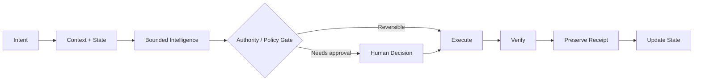

# Lalo Pacheco Sánchez — AI Systems Architecture

**AI systems architecture · enablement · orchestration · governed automation · human-centered operating systems**

I build systems that turn fragmented AI capabilities, software, data, workflows, and human decisions into coherent operating environments.

This repository is the public architecture layer for that work. It documents selected systems, patterns, and design decisions from a larger private implementation portfolio while deliberately separating **proof of capability** from **reusable proprietary machinery**.

## What I work on

My work sits at the intersection of:

- AI enablement and workflow transformation
- agent and service orchestration
- APIs, OAuth, integrations, and event-driven systems
- persistent state, provenance, evidence, and auditability
- human-in-the-loop authority and approval boundaries
- operational UX and attention management
- domain-specific AI runtimes
- full-stack product architecture

The recurring problem is not simply "add AI." It is:

> **How do you make many capabilities operate as one coherent system without making the human become the integration layer?**

## Current focus: Legal AI & governed professional workflows

I am currently applying this architecture work to **legal technology and legal AI**: evidence-grounded matter systems, legal-operations workflow automation, AI governance, professional handoffs, source provenance, structured approvals, and verified execution.

For a recruiter-facing map of this work, see **[Legal Technology Positioning](docs/LEGAL_TECH_POSITIONING.md)**.

This maps particularly well to roles such as **Legal Technology Solutions Architect, Applied AI / Implementation Architect, Legal AI Enablement, Legal Operations Technology, and AI Governance for Legal & Compliance**.

## Selected architecture

| System | Architectural problem | Public case study |
|---|---|---|
| **Kairos** | Relationship, communication, timing, follow-up, and person-specific next action | [View](case-studies/kairos.md) |
| **PhiNeX** | Evidence-to-resolution infrastructure with governance, provenance, and human approval | [View](case-studies/phinex.md) |
| **Marathon** | Work reconciliation across tasks, agents, approvals, documents, and partial execution | [View](case-studies/marathon.md) |
| **SynaptiQ** | Bounded human-pattern and domain intelligence runtimes without collapsing everything into one agent | [View](case-studies/synaptiq.md) |
| **SOPHIA** | Authority, jurisdiction, delegation, appeal, revocation, and accountability for agentic systems | [View](case-studies/sophia.md) |
| **Vizion** | Source-backed procedural guidance from intent through execution, verification, and receipt | [View](case-studies/vizion.md) |

## Architecture principles

### Capability is not authority
A model or agent being able to perform an action does not mean it is authorized to perform it.

### Intelligence should be bounded
Different domains retain distinct responsibilities, data boundaries, and execution semantics rather than being collapsed into one omnipotent agent.

### Humans should not be APIs
Systems should carry state and coordinate services directly. Human attention is reserved for judgment, authorization, relationships, and genuinely consequential decisions.

### Consequential actions need receipts
Important execution should be source-linked, permission-aware, observable, verifiable, and reconstructable.

### Complexity needs geometry
The underlying system can become sophisticated without requiring the human attention surface to become equally complicated.

## A recurring execution pattern

This pattern appears in different forms across the portfolio: legal/evidence operations, relationship intelligence, work reconciliation, procedural guidance, household operations, governance, and AI-assisted development.

## Portfolio boundary

This repository intentionally publishes architecture, sanitized flows, design rationale, selected screenshots, case studies, and non-proprietary implementation patterns.

It does **not** publish production credentials, customer/private data, proprietary orchestration machinery, reusable internal workflow libraries, private prompts/instructions, production adapters, deployment secrets, or material that would expose protected implementation IP.

See [Public Portfolio Boundary](docs/PUBLIC_PORTFOLIO_BOUNDARY.md).

## Current status

This public dossier is being built from working private repositories. Case studies distinguish between implemented capability, documented architecture, partial implementation, and future direction rather than presenting roadmap material as shipped software.

## About

**Lalo Pacheco Sánchez**

I came to AI systems work by building operating environments rather than isolated demos: connecting interfaces, state, APIs, automation, governance, evidence, and domain-specific intelligence until the pieces could function together.

The result is a portfolio centered on a practical question: **how do we turn AI capability into reliable organizational capability?**
