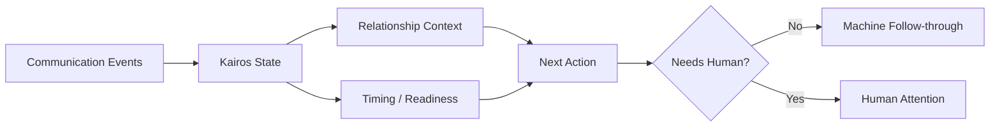

# Kairos — Relationship & Time Intelligence

**Source status:** architecture documented in the private `Kairos` repository.

## Problem

Communication tools commonly preserve messages while leaving the human responsible for reconstructing relationship state: who someone is, what happened previously, what is waiting, when follow-up is appropriate, and what action matters next.

## Architectural responsibility

Kairos owns actors, relationships, communication history, readiness, follow-up, cadence, opportunity timing, and person-specific next actions.

Its boundaries are deliberate: public broadcast/campaign creative belongs elsewhere, and route/funnel modeling is not silently absorbed into the relationship runtime.

## Why this matters

The design separates **event volume** from **human attention**. Systems can ingest many communications while escalating only meaningful state transitions, unresolved dependencies, or decisions requiring a person.

## Demonstrated competency

Domain boundaries, persistent relationship state, event-to-attention compression, next-action reasoning, and separation of relationship intelligence from broadcast infrastructure.
