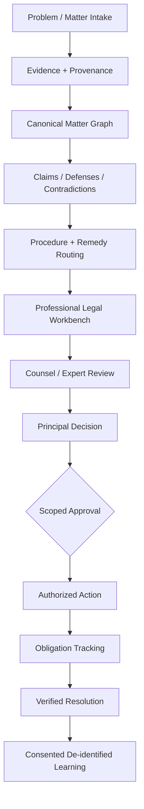

# Legal Tech Architecture — From Evidence to Governed Resolution

**Portfolio status:** public architecture synthesis grounded in the private PhiNeX implementation and current product-design work. It is intended to show transferable legal-tech systems thinking without exposing private case data, proprietary prompts, or confidential implementation details.

## Why this matters in legal tech

Legal technology is increasingly moving beyond document drafting into workflow transformation, matter intelligence, legal operations, AI adoption, and evidence-backed decision support.

My architecture work focuses on the parts that become difficult once legal AI leaves the demo stage:

- fragmented records and matter state;
- source provenance and citation traceability;
- legal/research freshness;
- adversarial fact patterns and contradictions;
- human review and professional boundaries;
- scoped approvals and audit trails;
- counsel handoff and workflow continuity;
- post-decision obligations and verified resolution.

## Core legal-tech architecture



## Problems I have designed for

### 1. Matter intake and reconstruction
High-stakes matters often begin as scattered emails, PDFs, receipts, notices, screenshots, policies, and personal accounts.

The architecture separates:
- source artifact;
- extracted content;
- assertion;
- allegation;
- inference;
- contradiction;
- legal proposition;
- event;
- actor;
- authority;
- commitment;
- deadline.

The goal is to avoid turning a chat transcript into the system of record.

### 2. Evidence provenance and auditability
Material conclusions should be traversable back to the source that supports them.

The private implementation includes:
- purpose-separated evidence, case, legal-intelligence, counsel, corpus, and audit stores;
- source-linked assertions;
- content hashes;
- append-only receipts;
- de-identification controls;
- human approval gates.

### 3. Adversarial analysis
Legal work requires more than summarizing the user's preferred theory.

The design explicitly supports:
- strongest supported position;
- strongest plausible opposing position;
- rebuttal and sur-rebuttal;
- adverse facts;
- missing evidence;
- unresolved contradictions;
- decisive factual or legal questions.

This is intended to make uncertainty inspectable rather than hide it behind model confidence.

### 4. Legal research and authority
Legal propositions are modeled separately from ordinary factual assertions.

The architecture requires:
- source provenance;
- jurisdiction;
- authority status;
- freshness/currentness;
- controlled ingestion of legal sources.

The system is designed to integrate with professional legal research providers rather than claim that an LLM's memory is legal authority.

### 5. Human-in-the-loop legal AI
A capable system is not automatically authorized to act.

Consequential actions are designed around:
- role and authority;
- professional review;
- approval scope;
- explicit human authorization;
- immutable execution receipt;
- resulting obligations;
- post-action verification.

### 6. Counsel continuity
Attorney handoff should not destroy the structured matter state.

The intended boundary is:

```text
consumer / business matter
  -> counsel-ready record
  -> professional legal analysis
  -> principal decision
  -> authorized legal action
  -> verified outcome
```

Legal advice and representation remain with qualified professionals. The system preserves provenance, matter state, authorization, and operational continuity.

### 7. Consumer protection and access to justice
A user may arrive before they know whether they have a legal claim.

The system therefore begins with:
- problem recognition;
- evidence preservation;
- deadline awareness;
- rights/duty/representation mapping;
- direct-resolution options;
- regulator/forum routing;
- professional escalation when needed.

The product objective is not maximal litigation. It is appropriate, evidence-backed resolution.

## Legal-tech capabilities demonstrated

- legal workflow architecture;
- evidence and provenance modeling;
- case/matter state design;
- retrieval and source-grounded reasoning;
- human-in-the-loop AI;
- legal AI governance;
- audit logging and action receipts;
- privacy and de-identification architecture;
- adversarial reasoning workflows;
- legal operations process design;
- counsel handoff;
- consumer-protection systems;
- access-to-justice product thinking;
- AI implementation in regulated/high-stakes environments.

## Where this maps to industry roles

This work is most directly relevant to roles such as:

- Legal AI Solutions Engineer
- Legal Technology / Innovation Specialist
- AI Implementation Consultant — Legal
- Solutions Architect — Legal Tech
- Legal Operations Technology Analyst
- Product / Implementation Specialist — Legal AI
- AI Governance / Responsible AI Analyst
- Customer Success / Enablement — Legal AI
- Workflow Automation Consultant — Legal
- Applied AI Product Manager — Legal / Regulated Workflows

## Product implementation lens

I am especially interested in the gap between buying an AI tool and making it operational.

That includes:

```text
workflow discovery
-> system/process mapping
-> data + integration design
-> governance boundary
-> prototype
-> user enablement
-> measurement
-> iteration
-> durable operating process
```

This is the same problem legal AI vendors are solving when they help firms and legal departments move from experimentation into repeatable daily workflows.

## Boundary

This case study does not claim licensed legal expertise or legal representation.

It demonstrates architecture, workflow, AI-governance, evidence, implementation, and operational-design competency for legal-tech environments.
