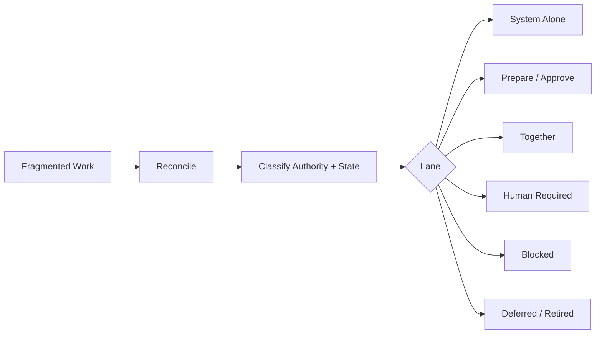

# Marathon — Work Reconciliation & Governed Autonomy

**Source status:** doctrine and product architecture are documented; implementation is partial.

## Problem

Work fragments across tasks, proposals, chats, agents, repositories, approvals, documents, automations, and partial implementations. A task list cannot reliably distinguish duplicate, superseded, unauthorized, incomplete, unverified, blocked, or genuinely finished work.

## Thesis

Marathon treats work as a reconciliation problem rather than a list problem.

Its operating lanes distinguish:

- system can execute independently;
- system can prepare but requires approval;
- human and system work together;
- human presence/authority is required;
- work is blocked;
- work is deferred or retired.

## Implementation honesty

The private repository explicitly records that doctrine and market-validation material exist, a job-tracker product slice builds but requires its database configuration to run as shipped, and reconciliation capability is partially implemented elsewhere in the operating stack.

## Demonstrated competency

State reconciliation, governed autonomy, work classification, dependency thinking, implementation-status discipline, and operational system design.
