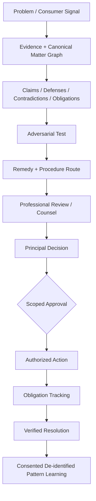

# PhiNeX — Consumer-Protection & Adversarial-Resolution Infrastructure

**Source status:** implemented architecture, tests, and active product-development branches are maintained in the private `PhiNex` repository. This public case study intentionally separates implemented capability from roadmap direction.

## Problem

High-stakes civil and institutional problems rarely begin as clean legal matters.

They begin as fragmented evidence, inconsistent communications, uncertain duties, conflicting accounts, deadlines, promises, procedural choices, and decisions that may waive rights or create new obligations.

A useful legal-technology system therefore needs to do more than draft.

It needs to preserve a reliable state of the matter from first signal through professional review and verified resolution.

## Architecture

PhiNeX models a matter as a governed set of linked objects rather than a chat transcript.

Core objects include:

- artifacts and source provenance;
- assertions, verified facts, allegations, inferences, and contradictions;
- actors, authority, knowledge, and notice;
- events, commitments, obligations, and deadlines;
- claims, elements, defenses, counterarguments, damages, and remedies;
- procedures and escalation routes;
- decisions, approvals, execution receipts, and resolution state.



## Adversarial reasoning

The target is not model confidence. The target is traceable reasoning under opposition.

A material position should be tested as:

```text
strongest supported position
-> strongest plausible opposing position
-> evidence-based rebuttal
-> strongest plausible sur-rebuttal
-> decisive fact / authority
-> missing evidence / unresolved uncertainty
```

This is the formalized version of "bulletproof" or "dead-to-rights": not certainty by rhetoric, but structured exposure of what survives adversarial testing and what remains vulnerable.

## Governance

The architecture separates capability from authority.

Consequential external actions are gated by explicit scope and produce receipts. Private case evidence remains isolated from de-identified learning by default. Legal propositions carry source and freshness state. Human or professional review remains distinct from system-generated recommendations.

## Consumer protection

Consumer protection is treated as a lifecycle, not only as one legal domain.

The system is designed to begin before a person knows whether they have a formal legal claim:

```text
What happened?
What did they promise?
What evidence exists?
What is disputed?
What deadline matters?
What remedy path is appropriate?
When is counsel or another professional required?
```

Domain modules can then instantiate that lifecycle for employment, housing, insurance, financial services, consumer transactions, and other civil matters.

## Principal Decision Readiness

A professional recommendation and a principal's decision are different objects.

The current architecture specifies a governed decision layer that can expose:

- the exact question requiring approval;
- evidence and uncertainty;
- authority;
- alternatives;
- rights or waivers;
- consequences;
- required professional review;
- approval scope;
- execution receipts;
- resulting obligations;
- verification state.

## Professional workbench boundary

PhiNeX is not intended to recreate every mature legal-tech category.

Enterprise legal research, e-discovery, docket systems, document-management systems, and office-suite tooling can be integrated where appropriate.

PhiNeX should own the canonical matter state, provenance, adversarial structure, authorization, and resolution lifecycle.

## Demonstrated competency

- legal-tech systems architecture;
- evidence and provenance modeling;
- structured matter state;
- adversarial reasoning design;
- legal-operations workflow decomposition;
- AI governance and approval boundaries;
- privacy and tenant isolation;
- de-identification;
- human-in-the-loop execution;
- counsel handoff design;
- obligation tracking;
- auditability and verification;
- consumer-protection product architecture.

## Role relevance

This architecture maps directly to work in:

- Legal Technology Solutions Architecture
- Applied AI for Legal
- Legal AI Enablement
- Legal Operations Technology
- Litigation / Evidence AI
- Legal & Compliance AI
- AI Governance for Professional Workflows
- Implementation / Solutions Engineering in legal-tech platforms
