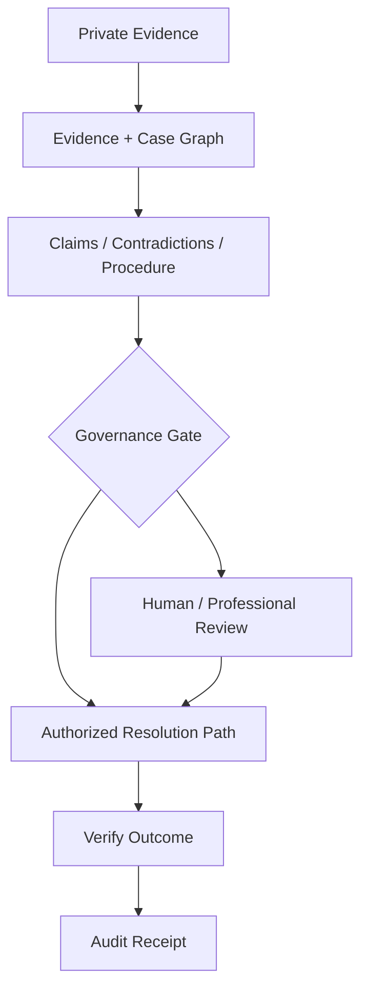

# PhiNeX — Governed Evidence-to-Resolution Infrastructure

**Source status:** implemented architecture and tests are described in the private `PhiNex` repository.

## Problem

High-stakes matters arrive as fragmented records: documents, communications, allegations, timelines, legal or institutional authority, procedural choices, and consequential actions.

## Architecture

PhiNeX converts records into source-linked case objects, tests assertions against evidence and authority, routes matters through bounded processes, records consequential actions, and gates external/corpus-affecting behavior behind scoped human approval.

The private implementation describes six purpose-separated SQLite stores, evidence/case/corpus/legal/counsel/audit schemas, governance gates, deterministic pseudonymization and redaction signals, source-linked legal-intelligence ingestion, full-text retrieval over approved de-identified records, and architecture/governance tests.

## Design principle

The system is not positioned as an autonomous lawyer. It is an accountable operating layer between human experience, evidence, authority, and institutions capable of acting.

## Demonstrated competency

Evidence architecture, data isolation, governance, de-identification, provenance, auditability, bounded AI roles, and high-stakes human approval.
