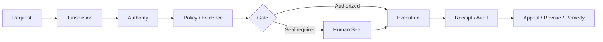

# SOPHIA — Governance & Constitutional Authority for Agentic Systems

**Source status:** Phase 0 canon formation and minimum governance-kernel design.

## Core premise

> **Capability is not authority.**

An AI system may be technically capable of reasoning, predicting, executing, allocating resources, or controlling infrastructure. Technical capability alone does not establish legitimate authority.

## Architecture

SOPHIA decomposes intelligence, authority, execution, infrastructure, memory, security, visibility, and command rather than concentrating them in a single agent.

For consequential actions the architecture asks who is requesting, who has authority, under what jurisdiction, what evidence supports the action, which policy constrains it, whether a human seal is required, what rights/appeals/revocation exist, what record survives, and who is accountable.

## Demonstrated competency

AI governance, delegated authority, jurisdiction, human oversight, revocation, auditability, separation of powers, and governance-by-design.
