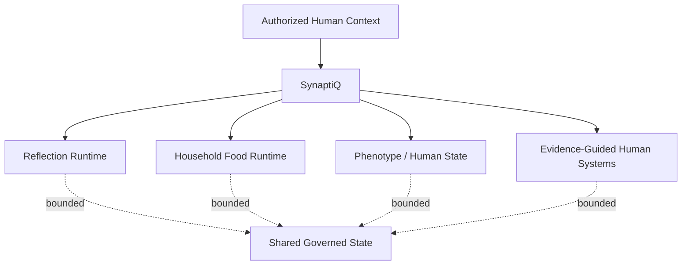

# SynaptiQ — Bounded Human & Domain Intelligence

**Source status:** multiple bounded runtimes are documented in the private `SynaptiQ` repository.

## Architectural question

How can an AI environment reason across complex human and household domains without collapsing every kind of intelligence into one agent with unlimited scope?

## Approach

SynaptiQ preserves bounded runtimes with explicit jurisdiction. Documented examples include Shadow Alchemy for reflective pattern work, Vincenzo for household food intelligence and kitchen execution, a phenotype/human-state runtime for longitudinal evidence and competing hypotheses, and a broader human-systems layer.

## Design principle

Specialization is preserved internally. Shared context does not imply shared authority.

## Demonstrated competency

Domain decomposition, consent boundaries, longitudinal state, competing hypotheses, human-centered architecture, and separation of reasoning responsibilities.
