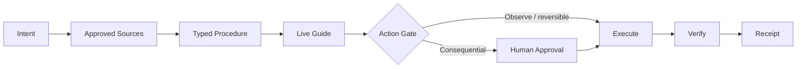

# Vizion — Governed How-To Runtime

**Source status:** product contract and staged implementation roadmap are documented; implementation is intentionally incremental.

## Problem

Tutorials explain. Operational guidance must stay with the user through execution, uncertainty, safety gates, verification, and recovery.

## Runtime

Vizion models a procedure as a stateful graph rather than prose. Steps can include prerequisites, source/version IDs, completion conditions, media/spatial focus, confidence, hazards, reversible/consequential action semantics, confirmations, verification, rollback, escalation, and receipt events.

The architecture explicitly exposes uncertainty rather than fabricating certainty when synthesis cannot be repaired within bounded attempts.

## Demonstrated competency

Procedural state machines, source-backed AI, accessible UX, confidence handling, action semantics, approval gates, verification, and operational receipts.
