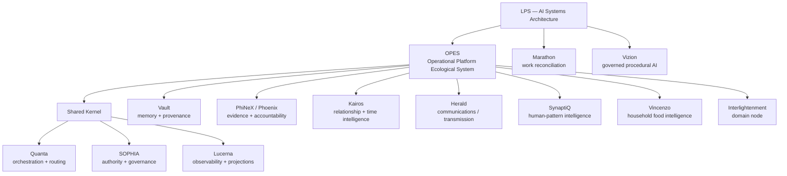
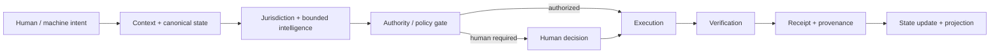

# Public IP Landscape

This document makes the scope and relationships of Lalo Pacheco Sánchez's architecture portfolio legible without publishing the proprietary machinery that materially lowers the cost of reproducing it.

> **Public evidence of the architecture is not a source-code mirror.** Implementation detail remains governed by the [public portfolio boundary](./PUBLIC_PORTFOLIO_BOUNDARY.md).

## System landscape

## The architectural thesis

The portfolio is organized around a recurring systems problem:

**Separate intelligences so each can operate clearly. Integrate them so the human does not have to become the API between their own systems.**

The current OPES construction documents express this as a persistent operational ecology: one canonical state environment, governed nodes, deterministic routing, memory and provenance, bounded model reasoning, and multiple projections over the same underlying reality.

## Portfolio map

| System | Public role | Evidence level represented publicly |
|---|---|---|
| **OPES** | Constitutional operating architecture: persistent state, typed ontology, routing, events, graph, memory, governed nodes and projections | Architecture frozen for implementation; executable reference implementation documented privately |
| **Quanta** | Shared-kernel orchestration, routing, state transitions and lifecycle | Documented as an OPES shared-kernel role |
| **SOPHIA** | Policy, authority, approval, jurisdiction and audit | Public case study; governance kernel architecture |
| **Lucerna** | Observability, telemetry and projection contracts | Documented as an OPES shared-kernel role |
| **Vault** | Cross-cutting memory, provenance and durable state plane | Documented in OPES architecture |
| **PhiNeX / Phoenix** | Governed evidence-to-resolution and accountability infrastructure | Public case study backed by private implementation architecture and tests |
| **Kairos** | Relationship, communication-state and timing intelligence | Public case study backed by private architecture |
| **Herald** | Communications/transmission node within the operating ecology | Node documented in OPES; deeper public case study not yet published |
| **SynaptiQ** | Bounded human-pattern and domain intelligence | Public case study backed by multiple private runtimes |
| **Vincenzo** | Household food intelligence runtime/node | Documented within SynaptiQ and OPES; deeper public case study not yet published |
| **Interlightenment** | Distinct domain node in the OPES ecology | Node documented in OPES; deeper public case study not yet published |
| **Marathon** | Work reconciliation and governed autonomy | Public case study; partial implementation explicitly distinguished from doctrine |
| **Vizion** | Governed how-to/procedural AI runtime | Public case study; staged implementation roadmap |

## Shared execution pattern

The model may interpret ambiguity and propose transformations. It is not the source of truth, final authority, router, or persistence layer.

## What this demonstrates

The IP landscape is evidence of systems-level capability across AI orchestration, stateful applications, APIs and integrations, domain decomposition, memory and provenance, human-in-the-loop authority, governed automation, procedural AI, operational UX, and evidence-aware systems.

The defensible implementation remains private where disclosure would expose proprietary ontology, routing logic, reusable workflow machinery, prompts/instructions with implementation leverage, evaluation systems, production adapters, customer configuration, credentials, deployment infrastructure, or other cloning-enabling assets.

## Public evidence path

**IP landscape → architecture → case studies → technical depth → implementation evidence**

Current public case studies:

- [Kairos](../case-studies/kairos.md)
- [PhiNeX](../case-studies/phinex.md)
- [Marathon](../case-studies/marathon.md)
- [SynaptiQ](../case-studies/synaptiq.md)
- [SOPHIA](../case-studies/sophia.md)
- [Vizion](../case-studies/vizion.md)

This map intentionally distinguishes **existence and architectural scope** from disclosure of **reusable proprietary machinery**.
